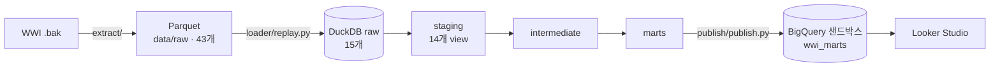

# 데이터 모델

> v1.0 · 2026-10-09
> KPI 정의는 [kpi_definitions.md](kpi_definitions.md)에 있습니다.

## 1. 전체 흐름



| 계층 | 위치 | 물리화 | 역할 |
|---|---|---|---|
| raw | DuckDB `raw` | 테이블 (로더가 관리) | 원천 그대로 + `_loaded_at`, `_batch_until` |
| staging | DuckDB `staging` | view | 원천 1:1. 이름을 snake_case로, 타입 보정, 쓰지 않는 컬럼 제외 |
| intermediate | (ephemeral) | ephemeral | 비즈니스 로직. marts에서만 참조 |
| marts | DuckDB `marts` → BigQuery `wwi_marts` | table / incremental | 대시보드용 넓은 팩트 3개 + 차원 2개 |
| snapshots | DuckDB `snapshots` | snapshot | 고객 SCD2 |

dev와 ci는 DuckDB 파일 자체가 분리되어 있습니다(`warehouse/wwi.duckdb`, `warehouse/ci.duckdb`). 그래서 스키마 이름에 타깃 접두어를 붙이지 않습니다(`macros/generate_schema_name.sql`).

---

## 2. 원천 추출 (`extract/`)

- SQL Server 2022 컨테이너에 `WideWorldImporters-Full.bak`을 복원하고, 테이블 27개와 시스템 버전 이력 테이블 16개를 Parquet로 추출했습니다(1회).
- 추출할 때 처리한 것:
  - geography 컬럼은 WKT 문자열로 바꿨습니다.
  - varbinary 컬럼(사진, 암호 해시)은 뺐습니다.
- 행 수 대조 결과는 `data/raw/_manifest.json`에 있습니다.

**추출 후 생긴 타입 문제:** NULL이 섞인 정수 컬럼은 pandas를 거치면서 실수(DOUBLE)가 됐습니다(예: `ColorID`, `BackorderOrderID`). staging에서 `bigint`로 되돌립니다.

---

## 3. 리플레이 적재 (`loader/replay.py`)

원천은 전체 기간이 한 번에 들어 있는 고정 데이터입니다. 그래서 `--until` 날짜까지 시간순으로 다시 흘려보내, incremental과 snapshot이 실제로 동작하게 합니다.

```bash
python loader/replay.py --until 2013-01-31 --reset   # 처음부터
python loader/replay.py --until 2013-02-28           # 다음 배치
```

| 종류 | 테이블 | 적재 규칙 |
|---|---|---|
| 트랜잭션 (6) | orders, order_lines, invoices, invoice_lines, customer_transactions, stock_item_transactions | 업무 일자가 (직전 `--until`, 이번 `--until`] 인 행만 **추가**합니다. 라인 테이블은 상위 문서의 일자를 따릅니다 |
| 마스터 (7) | cities, state_provinces, people, customers, customer_categories, buying_groups, stock_items | 현재 + 이력 테이블에서 `--until` 다음 날 0시에 유효했던 버전으로 **통째로 교체**합니다 (원천 전체 추출을 흉내 냄) |
| 정적 (1) | stock_item_holdings | 이력이 없어 매번 전체를 교체합니다. 그 시점의 품목 마스터에 있는 품목만 남깁니다 |
| 이력 (1) | customers_archive | `--until`까지 확정된 이력만 남깁니다. snapshot 검증용입니다 |

- **배치 상태:** `raw._replay_state`에 배치 기준일을 기록합니다. 직전 기준일보다 이전 날짜로 다시 적재하려 하면 거부합니다.
- **한 트랜잭션:** 배치 하나가 트랜잭션 하나로 처리됩니다. 중간에 실패하면 그 배치는 반영되지 않습니다.
- **검증:**
  - 전체를 2개 배치(2013-06-30, 2016-05-31)로 나눠 적재했을 때, 43개 테이블 행 수가 원천과 모두 일치했습니다.
  - staging 테스트가 2013-06-30, 2014-12-31, 2016-05-31 세 시점에서 모두 통과했습니다.
  - 이 과정에서 정적 테이블이 아직 생기지 않은 품목을 참조하는 문제를 relationships 테스트가 잡았습니다. 그래서 정적 테이블은 그 시점의 품목만 남기도록 고쳤습니다.
- **한계:** 트랜잭션은 추출 시점의 최종 상태로 들어갑니다. 예를 들어 주문 라인의 피킹 결과와 발주 라인의 입고 수량이 그렇습니다. 상태가 바뀌어 가는 과정은 재현하지 않습니다.

---

## 4. staging (`models/staging/wwi/`)

**규칙**
- 모델 이름은 `stg_wwi__<엔터티>`입니다.
- 원천 1:1이고, 조인과 집계는 하지 않습니다.
- 컬럼 이름은 snake_case입니다. 날짜는 `*_date`, 시각은 `*_at`, 불리언은 `is_*`입니다.
- 실수로 바뀐 ID는 `bigint`로 되돌립니다.
- 분석에 쓰지 않는 컬럼은 뺍니다: 수정자, 경계 폴리곤, 로그인·은행·마케팅 정보, 모두 NULL인 비고.
- 모든 모델에 `_loaded_at`을 남깁니다. 증분 처리 기준입니다.

| 영역 | 모델 |
|---|---|
| 판매 | `orders`, `order_lines`, `invoices`, `invoice_lines`, `customer_transactions`, `customers`, `customer_categories`, `buying_groups` |
| 품목 | `stock_items` |
| 재고 (DQ-01 테스트용) | `stock_item_holdings`, `stock_item_transactions` |
| 공통 | `people` (영업사원), `cities`, `state_provinces` (판매 지역) |

marts에 쓰는 원천만 staging으로 만듭니다. 구매, 공급사, 코드 테이블은 쓰지 않아서 소스에 선언하지 않았습니다. 이 테이블들의 데이터 품질 근거(DQ-02, DQ-03)는 추출한 Parquet에서 직접 계산했습니다.

**테스트 (82개)**
- 기본키: `unique`, `not_null`
- 주요 외래키: `relationships`
- 거래 유형 코드: `accepted_values`
  - 고객 거래: 1, 2, 3, 4, 13
  - 재고 거래: 9, 10, 11, 12
- 송장의 `order_id`: `unique` (주문 1건당 송장 1건)
- 소스 freshness: `_loaded_at` 기준으로 7일이 지나면 경고, 30일이 지나면 오류


---

## 5. intermediate · marts (Day 2~3 예정)

```
intermediate/
  int_orders_fulfillment        주문 ↔ 라인 집계 ↔ 송장 ↔ 백오더, 정시·전량 판정
  int_customer_ar_daily         청구 고객 × 일자 매출채권 잔액

marts/
  core/     dim_customer (SCD2), dim_stock_item
  sales/    fct_orders, fct_invoice_lines*
  finance/  fct_customer_credit_daily*
                                          * incremental
snapshots/  snap_customers   timestamp 전략, updated_at = ValidFrom
```

**marts를 넓은 팩트 테이블로 만드는 이유**
- Looker Studio는 테이블 간 관계를 정의할 수 없고, 블렌딩도 제약이 많습니다.
- 그래서 팩트마다 대시보드에 필요한 속성(고객명, 고객 분류, 구매 그룹, 영업사원, 판매 지역, 품목명)을 미리 붙여 게시합니다.
- 차원 2개는 SCD2 조인과 문서화를 위해 둡니다.

**snapshot 전략을 `timestamp`로 정한 이유**
- `check` 전략은 유효 시작 시각을 dbt 실행 시각으로 찍습니다. 리플레이에서는 그 시각이 업무 시점과 다르므로, 일자별 잔액과의 기간 조인이 깨집니다.
- `updated_at = ValidFrom`으로 두면 SCD2 유효기간이 원천의 업무 시점을 그대로 따릅니다.
- 고객 이력에서 실제로 바뀌는 컬럼은 `CreditLimit` 하나뿐이라, 버전이 늘어나는 것도 신용한도 변경과 일치합니다.

---

## 6. 변경 이력

| 버전 | 날짜 | 내용 |
|---|---|---|
| v1.0 | 2026-10-09 | 최초 작성: 추출, 리플레이, staging |
| v1.1 | 2026-10-09 | 과설계 점검: staging 27→14, raw 28→15, marts를 넓은 팩트 3개 + 차원 2개로 축소 |
